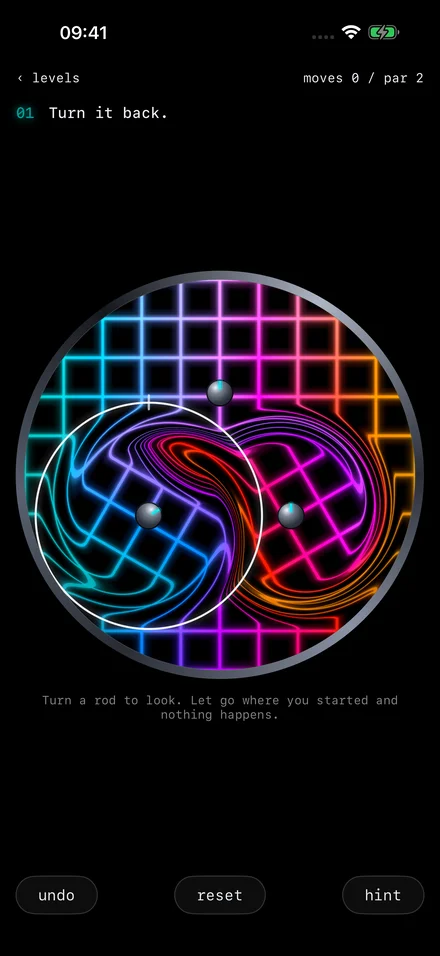
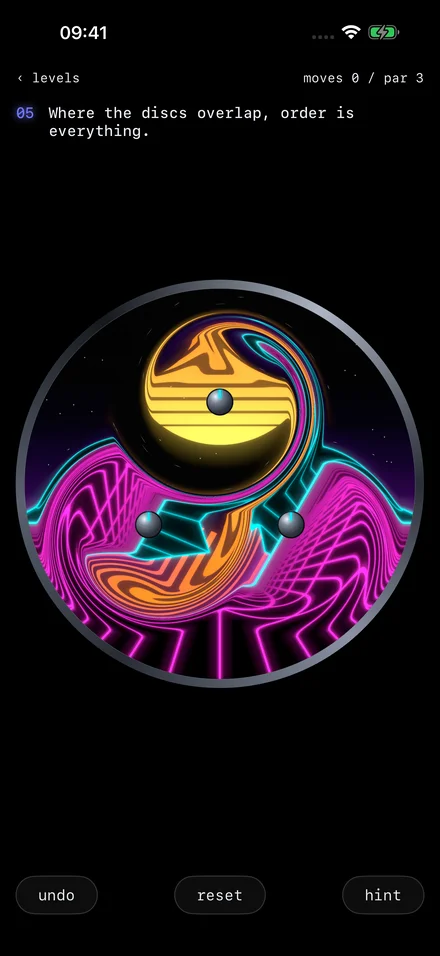
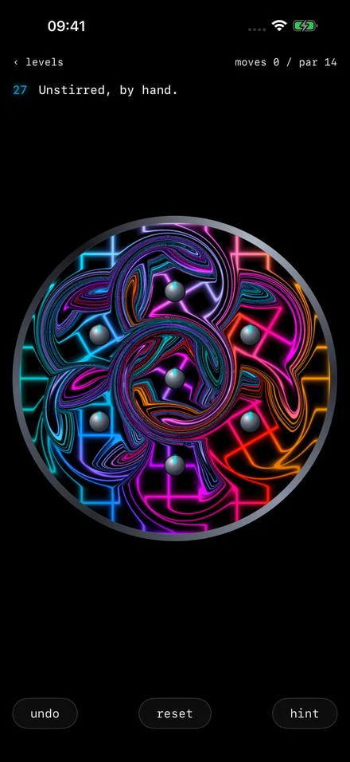
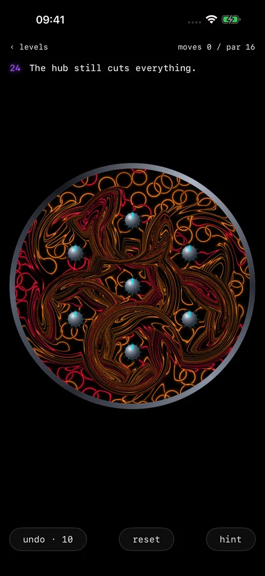

# Unstir

An iPhone puzzle game. Rods under a tank of picture twist it; you unwind the scramble by turning the rods back in the
right order. The tank only shows where the picture ended up, not the order the stirs went in.

<p>
  
  
  
  
</p>

27 levels in plughole, then whirlpool (deeper scrambles on live, moving pictures) and maelstrom, a daily tank,
endless, and a sandbox. SwiftUI and Metal, iOS 17, Swift 6, portrait only.

## Building

Built with Xcode 26 and [XcodeGen](https://github.com/yonaskolb/XcodeGen). `project.yml` is the source of truth; the
scripts generate `Unstir.xcodeproj` from it.

- Build: `scripts/build-ios.sh [Debug|Release] [device|sim]`
- Run on a phone: `UNSTIR_DEVICE=<udid> scripts/run-ios.sh [Debug|Release]`. Set `DEVELOPMENT_TEAM` in
  `project.yml` to your own team first.
- Test:
  ```
  xcodegen generate --quiet && xcodebuild test -project Unstir.xcodeproj -scheme Unstir \
    -destination 'platform=iOS Simulator,name=iPhone 17 Pro Max' -derivedDataPath build CODE_SIGNING_ALLOWED=NO
  ```
- Screenshots and films of any harness case, without touch: `scripts/shots.sh [pattern]`, `scripts/film.sh [pattern]`.

## Licence

Copyright © 2026 Jack Lusher. All rights reserved. The code is public to read; it is not licensed for reuse or
redistribution.
